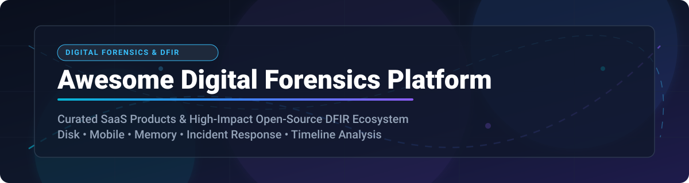

<!-- SEO Metadata
  Title: Awesome Digital Forensics Platforms & DFIR Tools (2026)
  Description: A comprehensive, curated list of top SaaS products and open-source GitHub projects for Digital Forensics and Incident Response (DFIR). Covers disk imaging, mobile extraction, RAM memory analysis, artifact triage, and forensic casework.
  Keywords: digital forensics, DFIR, incident response, memory forensics, mobile forensics, autopsy, sleuthkit, volatility, plaso, velociraptor, enase, ftk, cellebrite, magnet axiom
-->

  
  
  
  
  

  

# 🔍 Awesome Digital Forensics Platforms & DFIR Ecosystem 🛡️

> **Curated directory of SaaS commercial suites and open-source GitHub projects for Digital Forensics and Incident Response (DFIR).**

Welcome to the **Awesome Digital Forensics Platform** collection! This repository maintains an up-to-date, structured index of the leading **SaaS/Commercial Forensics Platforms** and **Open-Source Forensics Projects**. Whether conducting computer disk imaging, mobile phone acquisitions, cloud investigation, RAM memory forensics, or enterprise-wide endpoint threat hunting, this list connects DFIR analysts, law enforcement, and security teams with top-tier tools.

---

## 📑 Table of Contents 🧭

- [📈 Sector Overview & Market Size](#-sector-overview--market-size)
- [💼 SaaS & Commercial Platforms](#-saas--commercial-platforms)
- [🔓 Open-Source GitHub Projects](#-open-source-github-projects)
- [🏗️ Recommended DFIR Stack Integrations](#%EF%B8%8F-recommended-dfir-stack-integrations)
- [🤝 How to Contribute](#-how-to-contribute)
- [⚖️ Legal & Ethical Disclaimer](#%EF%B8%8F-legal--ethical-disclaimer)

---

## 📈 Sector Overview & Market Size

> [!NOTE]
> The **Global Digital Forensics Market** is estimated at **$11.2 Billion USD in 2026** and is projected to reach **$20.5 Billion USD by 2030** (CAGR ~13.5%). The market structure is **moderately fragmented**: concentrated commercial enterprise giants (OpenText, Cellebrite, Magnet Forensics) hold significant market share across government, law enforcement, and enterprise sectors, while an active, innovation-driven open-source community provides vital foundational frameworks used worldwide.

---

## 💼 SaaS & Commercial Platforms

Below are leading commercial and SaaS forensic platforms, ranked in descending order by estimated enterprise **financial scale / revenue / valuation**:

| 🏢 Product & Provider | 💵 Revenue / Valuation | 🏷️ Starting Price | 🎁 Free Tier / Trial Limit | 🔍 Core Forensic Specialization |
| :--- | :--- | :--- | :--- | :--- |
| **[OpenText EnCase](https://www.opentext.com/products/encase-forensic)** | ~$5.8B USD Revenue (Public) | $3,600 / year base license | 30-day trial (requires verified enterprise request) | Enterprise disk imaging, network forensics, court-ready reporting |
| **[Magnet AXIOM & GrayKey](https://www.magnetforensics.com/)** | ~$1.8B USD Valuation | $6,000 / year (AXIOM), $9,995 / year (GrayKey) | 30-day full evaluation trial (verified LE/Enterprise) | Artifact parsing, mobile bypass extraction, cloud analytics |
| **[Cellebrite Inseyets](https://cellebrite.com/)** | ~$1.6B USD Market Cap | $3,500 / year base subscription | 14-day cloud platform trial access | Mobile unlock, iOS/Android hardware extraction & physical decoding |
| **[Exterro FTK Enterprise](https://www.exterro.com/digital-forensics-software)** | ~$1.1B USD Valuation | $2,500 / year per seat | **FTK Imager is 100% Free Forever**; 30-day trial for FTK Enterprise | Distributed processing, disk analysis, eDiscovery integration |
| **[Oxygen Forensic Detective](https://www.oxygenforensic.com/)** | ~$85M USD Valuation | $2,999 / year dongle/license | 20-day full-feature trial (case limits apply) | Cloud data extractor, mobile device bypass & IoT forensics |
| **[MSAB XRY](https://www.msab.com/)** | ~$45M USD Revenue (Public: STO) | $3,200 / year base sub | 14-day evaluation license upon request | Portable field extraction & mobile hardware triage |
| **[Belkasoft X](https://belkasoft.com/x)** | ~$25M USD Valuation | $1,899 / year (Corporate) | 30-day trial (limited to 5 data sources & restricted export) | All-in-one mobile, RAM, disk, and cloud evidence processing |
| **[Paraben E3](https://paraben.com/)** | ~$15M USD Valuation | $995 / year base subscription | 15-day free trial (export limits apply) | Smartphone, IoT, email container, and hard drive investigation |
| **[X-Ways Forensics](https://www.x-ways.net/forensics/)** | ~$10M USD Valuation | €390 ($420 USD) perpetual | 30-day demo version (max file extraction limit 2GB) | High-speed, lightweight disk cloning & file system analysis |

---

## 🔓 Open-Source GitHub Projects

The open-source DFIR ecosystem powers incident response operations globally. Listed below are top open-source projects ranked in **descending order by GitHub Star count**:

| 📦 Repository & Project | 🌟 GitHub Stars (Social) | 🛠️ Primary Focus & Key Features |
| :--- | :--- | :--- |
| **[MVT (Mobile Verification Toolkit)](https://github.com/mvt-project/mvt)** |  | Forensic analysis of Android and iOS backups/sysdiagnose to detect Pegasus & mobile spyware artifacts. |
| **[YARA](https://github.com/VirusTotal/yara)** |  | The pattern-matching swiss army knife for malware researchers, memory scanners, and threat hunters. |
| **[Volatility 2](https://github.com/volatilityfoundation/volatility)** |  | Classic memory forensics framework for extraction of digital artifacts from volatile RAM samples. |
| **[CAPA](https://github.com/mandiant/capa)** |  | Automatically detects executable capabilities (e.g., process injection, keylogging) in suspicious binaries. |
| **[Awesome Forensics](https://github.com/cugu/awesome-forensics)** |  | Curated index of free and open-source digital forensics software, resources, and learning materials. |
| **[GRR Rapid Response](https://github.com/google/grr)** |  | Scalable enterprise incident response framework for remote agent live forensics across massive fleets. |
| **[Volatility 3](https://github.com/volatilityfoundation/volatility3)** |  | The modern Python 3 rewrite of Volatility for advanced memory forensics and kernel symbol analysis. |
| **[Velociraptor](https://github.com/Velocidex/velociraptor)** |  | Powerful endpoint visibility, VQL threat hunting, live response, and artifact collection tool. |
| **[Chainsaw](https://github.com/WithSecureLabs/chainsaw)** |  | Rapid Windows event log (EVTX) and MFT analyzer for rapid triage during incident response. |
| **[Timesketch](https://github.com/google/timesketch)** |  | Collaborative timeline analysis tool for indexing forensic timelines and multi-analyst casework. |
| **[Autopsy](https://github.com/sleuthkit/autopsy)** |  | Industry-standard open GUI digital forensics platform powered by The Sleuth Kit. |
| **[The Sleuth Kit (TSK)](https://github.com/sleuthkit/sleuthkit)** |  | Core library and command-line tools for low-level volume and file-system forensic investigation. |
| **[IPED](https://github.com/sepinf-inc/IPED)** |  | High-performance digital evidence indexer used by law enforcement for massive case file parsing. |
| **[Plaso (log2timeline)](https://github.com/log2timeline/plaso)** |  | Unified super-timeline creation engine extracting timestamps across system logs and file artifacts. |
| **[Speakeasy](https://github.com/mandiant/speakeasy)** |  | Emulation platform designed to emulate OS user-mode and kernel-mode malware execution for triage. |
| **[Dissect](https://github.com/fox-it/dissect)** |  | Modular Python forensic framework to access disk images, file systems, and structured forensic artifacts. |
| **[Turbinia](https://github.com/google/turbinia)** |  | Automation framework for cloud forensic processing across GCP, AWS, and Azure disks. |
| **[DFIRTrack](https://github.com/DFIRTrack/dfirtrack)** |  | Incident response case management tool tracking systems, evidence items, and compromised hosts. |

---

## 🏗️ Recommended DFIR Stack Integrations

> [!TIP]
> **Building a Modern Forensic Workstation:**
> - **Disk Imaging & Analysis:** FTK Imager / Guymager ➡️ [Autopsy](https://github.com/sleuthkit/autopsy) & [The Sleuth Kit](https://github.com/sleuthkit/sleuthkit)
> - **Volatile Memory:** [Volatility 3](https://github.com/volatilityfoundation/volatility3) ➡️ [CAPA](https://github.com/mandiant/capa)
> - **Timeline & Log Analysis:** [Plaso](https://github.com/log2timeline/plaso) ➡️ [Timesketch](https://github.com/google/timesketch)
> - **Enterprise Live Response:** [Velociraptor](https://github.com/Velocidex/velociraptor) or [GRR Rapid Response](https://github.com/google/grr)
> - **Mobile Inspection:** [MVT](https://github.com/mvt-project/mvt) (Open Source) + Magnet AXIOM / Cellebrite (Commercial Mobile Extraction)

---

## 🤝 How to Contribute

Contributions are highly appreciated! Help keep this repository updated with cutting-edge DFIR solutions.

1. 🍴 **Fork** this repository.
2. 📝 **Add/Update** tool details in `README.md`.
3. 🔬 Ensure links, star badges, pricing, and free trial descriptions are accurate.
4. 🚀 **Submit a Pull Request** with a brief summary of additions.

---

## ⚖️ Legal & Ethical Disclaimer

> [!CAUTION]
> This repository is compiled strictly for educational, defensive, and lawful forensic research purposes. Always verify proper legal authorization, maintain chain of custody, and ensure compliance with applicable jurisdiction laws prior to conducting forensic extractions or memory acquisitions.

---

  <b>⭐ Star this repository if you find it helpful for your DFIR investigations! ⭐</b>

